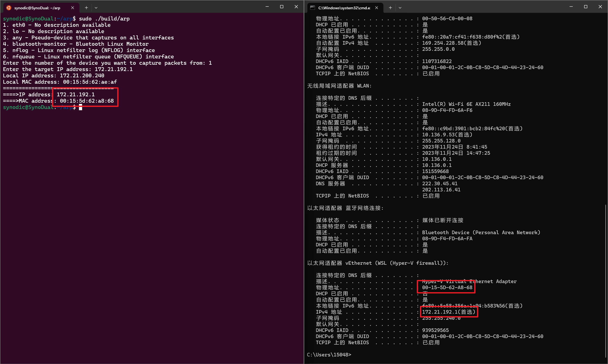
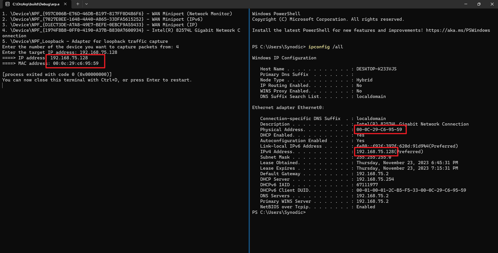

<div align="center">

# 网络技术与应用实验报告
## 实验3：通过编程获取IP地址与MAC地址的对应关系
学号：2112052  姓名：郭大玮  专业：物联网工程

</div>

## 实验要求

通过编程获取IP地址与MAC地址的对应关系实验，要求如下：
1. 在IP数据报捕获与分析编程实验的基础上，学习NPcap的数据包发送方法。
2. 通过NPcap编程，获取IP地址与MAC地址的映射关系。
3. 程序要具有输入IP地址，显示输入IP地址与获取的MAC地址对应关系界面。界面可以是命令行界面，也可以是图形界面，但应以简单明了的方式在屏幕上显示。
4. 编写的程序应结构清晰，具有较好的可读性。

## libpcap数据包发送方法

libpcap 提供了 `pcap_sendpacket` 和 `pcap_inject` 函数用于发送数据包，其原型如下：

```cpp
int pcap_sendpacket(pcap_t *p, const u_char *buf, int size);
int pcap_inject(pcap_t *p, const void *buf, size_t size);
```

其中 `p` 是 pcap_t 对象，`buf` 是数据包缓冲区，`size` 是数据包长度。

`pcap_sendpacket` 函数返回 0 表示成功，返回 -1 表示失败。
`pcap_inject` 函数返回写入数据包的字节数，如果出错则返回 -1。

### 关于 windows 和 linux 下发包的区别

libpcap 不支持环回 NDIS 数据包，因此使用 libpcap 自己构造发出的包不会回环到本地，主机便无法对自己构造的广播 ARP 报文进行响应。^[https://github.com/nmap/npcap/issues/116]
而 0.9990 之后的 Npcap 通过 WINAPI 的 `NdisSendNetBufferLists` 函数的 `SendFlags` 参数中设置 `NDIS_SEND_FLAGS_CHECK_FOR_LOOPBACK` 标志，使得 NDIS 环回数据包，因此在 Windows 下使用 Npcap 可以实现伪造 ARP 对自己发包，从而获得自己的 MAC 地址。^[https://learn.microsoft.com/zh-cn/windows-hardware/drivers/network/ looping-back-ndis-packets]

因此本次实验分别在 Windows (Npcap) 和 Ubuntu (libpcap) 下实现，Windows 版本通过伪造 ARP 报文发送给自己获取 MAC 地址，Ubuntu 版本通过 `ioctl` 系统调用获取 MAC 地址。

*（仅为个人理解对实验现象的解释，如有错误请指正。）*
## 具体实现

### Ubuntu (libpcap) 版本获取本机 IP 和 MAC 地址
通过 `ioctl` `SIOCGIFHWADDR` 获取本机 MAC 地址（省略了错误处理）

```cpp
bool get_local_mac(const char* if_name, uint8_t* mac_addr) {
    int fd = socket(AF_INET, SOCK_DGRAM, 0); // create a socket
    struct ifreq ifr;
    size_t if_name_len = strlen(if_name);
    memcpy(ifr.ifr_name, if_name, if_name_len); // interface name
    ifr.ifr_name[if_name_len] = 0;
    if (ioctl(fd, SIOCGIFHWADDR, &ifr) == -1) { // get the MAC address
        perror("IOCTL error");
        close(fd);
        return false;
    }
    close(fd);
    memcpy(mac_addr, ifr.ifr_hwaddr.sa_data, 6); 
    return true;
}
```
同理使用 `SIOCGIFADDR` 也能获得本机 IP 地址


### ARP 报文构造

```cpp
bool send_arp_request(pcap_t* handle, const uint8_t* local_mac, const char* local_ip, const char* target_ip) {
    struct ether_header eth_hdr;
    struct ether_arp arp_req;

    // set ethernet header fields
    memset(eth_hdr.ether_dhost, 0xff, sizeof(eth_hdr.ether_dhost)); // broadcast
    memcpy(eth_hdr.ether_shost, local_mac, sizeof(eth_hdr.ether_shost)); // sender MAC address
    eth_hdr.ether_type = htons(ETHERTYPE_ARP); // Ethernet type

    // set ARP request fields
    arp_req.arp_hrd = htons(ARPHRD_ETHER); // hardware type
    arp_req.arp_pro = htons(ETH_P_IP); // protocol type
    arp_req.arp_hln = ETHER_ADDR_LEN; // hardware address length
    arp_req.arp_pln = sizeof(in_addr_t); // protocol address length
    arp_req.arp_op = htons(ARPOP_REQUEST); // ARP operation
    memcpy(arp_req.arp_sha, local_mac, sizeof(arp_req.arp_sha)); // sender hardware address
    inet_pton(AF_INET, local_ip, &arp_req.arp_spa); // sender IP address
    memset(arp_req.arp_tha, 0, sizeof(arp_req.arp_tha)); // target hardware address
    inet_pton(AF_INET, target_ip, &arp_req.arp_tpa); // target IP address

    // combine the Ethernet header and ARP request into a packet
    uint8_t packet[sizeof(eth_hdr) + sizeof(arp_req)];
    memcpy(packet, &eth_hdr, sizeof(eth_hdr));
    memcpy(packet + sizeof(eth_hdr), &arp_req, sizeof(arp_req));

    // Send the packet
    if (pcap_sendpacket(handle, packet, sizeof(packet)) != 0) {
        // 省略错误处理
    }
    return true;
}
```

 - 以太网帧：
   - 源地址：本机 MAC 地址
   - 目的地址：广播地址（FF:FF:FF:FF:FF:FF）
 - ARP 报文：
   - 硬件类型：以太网（1）
   - 协议类型：IPv4（0x0800）
   - 硬件地址长度：6
   - 协议地址长度：4
   - 操作码：ARP 请求（1）
   - 源 MAC 地址：本机 MAC 地址
   - 源 IP 地址：本机 IP 地址
   - 目的 MAC 地址：0 （00:00:00:00:00:00）
   - 目的 IP 地址：要查询的 IP 地址

之后将以太网帧和 ARP 报文拼接成一个数据包，使用 `pcap_sendpacket` 或 `pcap_inject` 函数发送数据包。

### 捕获和解析 ARP 回复

```cpp
bool get_mac_from_arp_reply(pcap_t* handle, const char* target_ip, uint8_t* target_mac) {
    const u_char* packet;
    struct pcap_pkthdr* header;
    struct ether_arp* arp_reply;
    struct in_addr target_addr, sender_addr;
    inet_pton(AF_INET, target_ip, &target_addr);

    while (true) {
        int res = pcap_next_ex(handle, &header, &packet);
        if (res == 0) continue; // Timeout elapsed
        if (res == -1 || res == -2) break; // Error or EOF

        struct ether_header* eth_hdr = (struct ether_header*)packet;
        if (ntohs(eth_hdr->ether_type) == ETHERTYPE_ARP) {
            arp_reply = (struct ether_arp*)(packet + sizeof(struct ether_header));
            memcpy(&sender_addr, arp_reply->arp_spa, sizeof(sender_addr));

            // ensure this is an ARP reply (2) for the correct target IP
            if (ntohs(arp_reply->arp_op) == ARPOP_REPLY && target_addr.s_addr == sender_addr.s_addr) {
                memcpy(target_mac, arp_reply->arp_sha, sizeof(arp_reply->arp_sha));
                return true;
            }
        }
    }
    return false;
}
```
捕获到数据包后，若是 ARP 回复报文，且源 IP 地址为要查询的 IP 地址，则将源 MAC 地址拷贝到 `target_mac` 中返回。

### 主函数

首先同实验二，查找所有网卡设备，让用户选择一个网卡，然后打开网卡设备。代码复用实验二的代码，此处不再赘述。

让用户输入要查询的 IP 地址。
```cpp
std::cout << "Enter the target IP address: ";
std::cin >> target_ip;
```

Ubuntu 版本调用 `get_local_ip` 和 `get_local_mac` 函数获取本机 IP 地址和 MAC 地址。
```cpp
if (!get_local_mac(device->name, local_mac) || !get_local_ip(device->name, local_ip)) {
    std::cerr << "Couldn't get local MAC or IP address." << std::endl; 
    pcap_close(handle);
    return 1;
}
```

Windows 版本直接伪造一个本机 IP 地址和 MAC 地址。
```cpp
strcpy(local_ip, "172.21.192.1");
memcpy(local_mac, "\x00\x15\x5d\x8c\x94\xea", 6);
```

发送 ARP 请求报文。
```cpp
if (!send_arp_request(handle, local_mac, local_ip, target_ip)) {
    pcap_close(handle);
    return 1;
}
```

捕获 ARP 回复报文并解析，获取目标 IP 地址对应的 MAC 地址并输出。
```cpp
if (get_mac_from_arp_reply(handle, target_ip, target_mac)) {
    std::cout << "====>IP address: " << target_ip << "\n====>MAC address: ";
    for (int i = 0; i < 6; i++) {
        std::cout << std::setw(2) << std::setfill('0') << std::hex << (int)target_mac[i];
        if (i < 5) std::cout << ":";
    }
    std::cout << std::endl;
} else {
    std::cerr << "Could not get MAC address for IP " << target_ip << std::endl;
}
```
## 运行结果

Ubuntu（WSL）下查找宿主机（vEthernet）的 MAC 地址：


Windows 下查找本机 MAC 地址：
